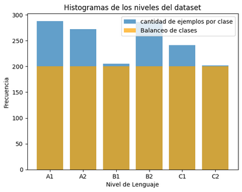
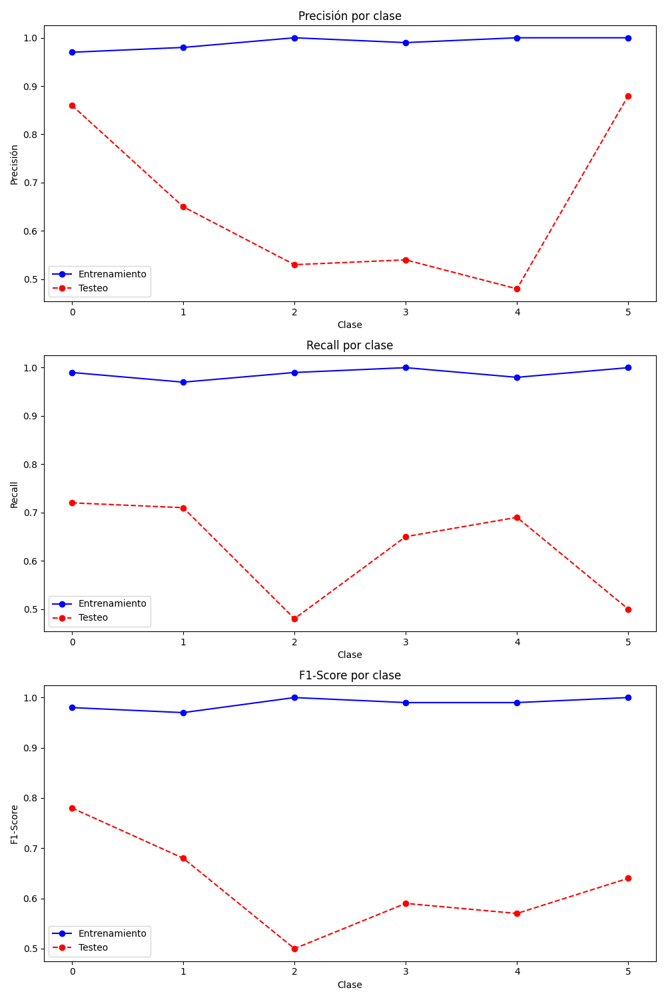
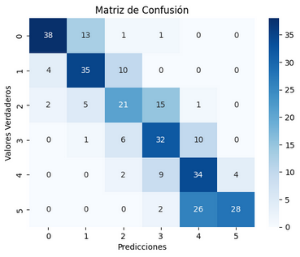
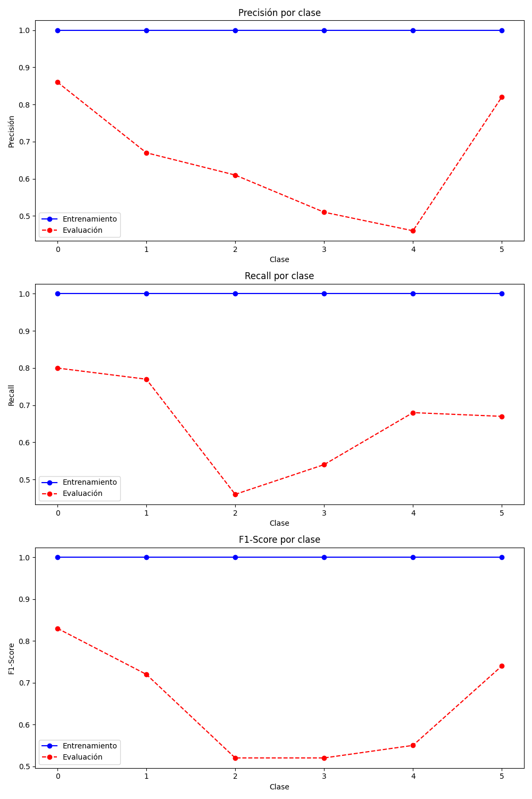
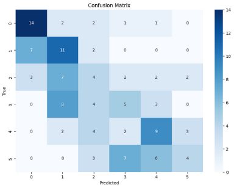

# Adaptación de Textos para el Aprendizaje de Lenguas Castellanas 📚

## Resumen ✍️

En este proyecto, buscamos adaptar un texto en castellano a diferentes niveles de aprendizaje del MCER (A1, A2, B1, B2, C1, C2) utilizando un modelo de lenguaje, de manera que se transcriba al nivel deseado sin perder su significado original.

## Hipótesis de Trabajo 🤔

- Todo texto puede clasificarse en un nivel de aprendizaje MCER (A1, A2, B1, B2, C1, C2).
- Es posible reescribir un texto en distintos niveles sin alterar su significado original.

## Objetivos Preliminares 🎯

1. Obtener un dataset con textos en castellano etiquetados por nivel (A1, A2, B1, B2, C1, C2).
   - Aunque intentamos conseguir un dataset en castellano, no tuvimos éxito. Como alternativa, utilizamos un dataset en inglés ya etiquetado y lo traducimos al castellano.
   - **Nota**: La traducción podría introducir ruido en los datos. Se estimará el impacto del ruido generado.
   
2. Buscar modelos de lenguaje adecuados para la tarea de adaptación de textos en castellano.
   - Se evaluaron dos opciones: **Mistral** y **Cohere**.

3. Obtener o entrenar un clasificador de texto para los niveles MCER en castellano.
   - Realizamos un balanceo de clases en el dataset traducido, el cual consta de 1200 textos (200 textos por clase).
   - Se entrenaron modelos utilizando BERT y LinearSVC.
     - **Resultados**: BERT alcanzó una precisión de **66%**, mientras que LinearSVC obtuvo **55%**.
     - Las predicciones incorrectas se concentraron principalmente en niveles adyacentes (los errores fueron menores).
     - Se utilizó la **precisión aproximada** (o precisión intuitiva), donde los errores en niveles adyacentes se consideran como medio acierto (0.5).

4. Comparar la precisión y velocidad de adaptación de textos de cada modelo de lenguaje.
   - Se utilizó una muestra del subdataset balanceado con 120 textos (20 textos por clase).
   - Para la comparación, se usó el clasificador entrenado previamente.
   - **Resultados**:
     - **Cohere**: 15 minutos, Precisión Exacta del **39%**, Precisión Aproximada del **55%**.
     - **Mistral**: 45 minutos, Precisión Exacta del **21%**, Precisión Aproximada del **38%**.

5. Fine-tuning del modelo de lenguaje con mejor rendimiento.
   - Decidimos realizar fine-tuning con **Cohere** (el modelo de mejor rendimiento).
     - **Ventaja**: Cohere ofrece una API que permite realizar fine-tuning con un dataset tipo chat, lo que ahorra capacidad de cómputo.
     - **Limitación**: Esta es la única forma de realizar fine-tuning y sus capacidades son limitadas a menos que se adquiera una suscripción. A pesar de esto, esperamos obtener resultados satisfactorios.

## Referencias 📚

- **Modelos de Lenguaje**:
  - [Mistral AI | Frontier AI in your hands](https://mistral.ai/)
  - [Cohere | The leading AI platform for enterprise](https://cohere.com/)
  
- **Dataset en Inglés**: [CEFR Levelled English Texts (Kaggle)](https://www.kaggle.com/datasets/amontgomerie/cefr-levelled-english-texts)

- **Traductor EN-ES**: [Helsinki-NLP/opus-mt-en-es · Hugging Face](https://huggingface.co/Helsinki-NLP/opus-mt-en-es)

- **Traducción (Código)**: [notebook9834025409 | Kaggle](https://www.kaggle.com/code/alexistomascenteno/notebook9834025409/edit/run/197471934)

## Planificación 📅

- **Semana 1** (Septiembre 23 a 29):
  - Conseguir un dataset con textos en castellano etiquetados por nivel MCER (Objetivo 1).
  
- **Semana 2** (Septiembre 30 a Octubre 6):
  - Traducir el dataset en inglés al castellano (Objetivo 1).
  - Buscar modelos de lenguaje adecuados para la tarea de adaptación de textos en castellano (Objetivo 2).
  
- **Semana 3** (Octubre 7 a 13):
  - Entrenar un clasificador de texto para los niveles MCER en castellano (Objetivo 3).
  
- **Semana 4** (Octubre 14 a 20):
  - Comparar precisión y velocidad de adaptación de textos de cada modelo de lenguaje (Objetivo 4).
  
- **Semana 5** (Octubre 21 a 27):
  - Realizar fine-tuning del modelo de lenguaje con mejor rendimiento (Objetivo 5).
  
- **Semana 6** (Septiembre 28 a Noviembre 3):
  - Estimación del ruido generado por la traducción (Incorporación de feedbacks).
  - Exploración de fine-tuning para mejorar el desempeño (Objetivo 5).
  - Elaboración de informe: últimas pruebas y ajustes.

## Desarrollo del Proyecto 🔧

### 1. Dataset 📂

El primer paso fue obtener un conjunto de datos con textos etiquetados según los niveles del MCER. No encontramos un dataset adecuado en español, por lo que optamos por traducir el dataset **[CEFR Levelled English Texts (Kaggle)](https://www.kaggle.com/datasets/amontgomerie/cefr-levelled-english-texts)** del inglés al español.

|  |  |
|:--------------------------------:|:--------------------------------:|
| Texto original en inglés         | Texto traducido al español      |

La traducción puede introducir errores en las etiquetas, generando **ruido** en los datos. A pesar de ello, utilizamos este dataset con la expectativa de que sea suficiente para entrenar el modelo.

Para minimizar sesgos, realizamos un **balanceo de clases**, tomando como referencia la clase minoritaria (C2 = 200).



Este balanceo ayuda a evitar que el modelo favorezca las clases mayoritarias e ignore patrones importantes en las minoritarias.


### 2. Clasificador 🔍

Antes de iniciar las pruebas con modelos de lenguaje, es fundamental contar con un **clasificador de texto** que nos permita realizar comparaciones de precisión. Como mencionamos anteriormente, no encontramos un clasificador específico para textos en español que utilice niveles del MCER. Por lo tanto, decidimos entrenar un clasificador utilizando un conjunto de datos ya etiquetado. 

#### Enfoques de entrenamiento 🔬
Exploramos diferentes enfoques de entrenamiento para el clasificador:

- **BERT** 🤖
- **FeedForward** 🧠
- **LinearSVC** ⚙️

Los mejores resultados se obtuvieron entrenando con **BERT**, siguiendo la [Guía de entrenamiento](https://youtu.be/8yrD0hR8OY8?si=YWhzLPNBcfRtAq2Y) y utilizando **AutoModelForSequenceClassification** con los siguientes parámetros:

- 75% de los datos destinados para entrenamiento y 25% para pruebas.
- 12 épocas ⏳.
- **Batch size** = 32.

### Precisión del Clasificador 📊



Si graficamos las precisiones en función de las diferentes clases, podremos identificar más claramente cuáles son las clases problemáticas. El clasificador tuvo mayores dificultades para distinguir los casos intermedios, en particular los de la clase **C1**.


Esta problemática se evidencia aún más en la **matriz de confusión**.



A pesar de esto, las predicciones erróneas se concentran principalmente en los niveles adyacentes, un pequeño desfase que incluso pueden experimentar los profesionales. Por lo tanto, la **precisión del 66%** se refiere únicamente a las **predicciones exactas**.

### Precisión Aproximada 📈

Para una mejor comprensión, utilizamos una métrica alternativa: **Precisión Aproximada**, con la siguiente corrección de desfase:

- **Corrección = | nivel_esperado − nivel_predecido |**
- Si la corrección es **0**, la predicción es **correcta** (1 punto). ✅
- Si la corrección es **1**, la predicción es **aproximadamente correcta** (0.5 puntos). 🤔
- En cualquier otro caso, la predicción es **incorrecta** (0 puntos). ❌

Bajo esta métrica, la **precisión exacta** es del **66%**, pero la **Precisión Aproximada** es del **96%**. 🎯

### Comparación con Clasificador en Inglés 🌍

Para analizar el **ruido de la traducción**, desarrollamos un clasificador en inglés con los mismos parámetros de entrenamiento y datos equilibrados. 



La similitud entre las **matrices de confusión** de ambos clasificadores demuestra que la **traducción genera un ruido casi imperceptible**. 🤖


### 3. Modelos de lenguaje 🌐

En esta sección, probaremos dos modelos que se han destacado por su facilidad de uso y efectividad a la hora de generar respuestas mediante un prompt:

- **Mistral** 🤖
- **Cohere** 🌐

Tomamos una muestra de 120 textos y asignamos aleatoriamente un nivel de competencia lingüística a cada uno. Para ambos modelos, utilizamos el siguiente prompt:

```python
prompt = lambda label, text:  f"""

A continuación, te proporcionaré un texto en español y te pediré que lo modifiques para diferentes niveles de competencia lingüística
(A1, A2, B1, B2, C1 y C2), concretamente: {label}. El objetivo es que adaptes el texto según el nivel de dificultad, modificando el
vocabulario y las estructuras gramaticales para que se ajusten a cada nivel, pero manteniendo el mismo mensaje central. Solo responde
con la versión del texto modificada para dicho nivel. No incluyas ninguna introducción, título, explicación o comentario. Solamente dame
el texto adaptado.

Aquí está el texto:
{text}
"""
```

En este caso, **label** representa el nivel lingüístico deseado para la modificación del texto, y **text** es el texto base que se adaptará.

### Evaluación de los modelos 📊
#### Mistral 🤖

* Tiempo de ejecución: 47 minutos.
* Precisión exacta: 20.83%.
* Precisión aproximada: 37.91%.

Como se puede observar, las predicciones (considerando la corrección mencionada al final de la sección anterior) son bastante deficientes, con un rendimiento por debajo de 0.5. Esta situación se ilustrará claramente en la matriz de confusión.


#### Cohere 🌐

* Tiempo de ejecución: 16 minutos.
* Precisión exacta: 39.17%.
* Precisión aproximada: 55%.

Observando la matriz de confusión, queda claro que Cohere supera a Mistral en todos los aspectos de esta tarea, o al menos interpretando de manera mas efectiva el prompt al generar textos de mayor calidad.



Se puede observar la dificultad para diferenciar los casos intermedios, especialmente en las clases B1 y B2, así como en el caso de C2. Considerando el tiempo de ejecución y los resultados obtenidos, **Cohere** se presenta como la mejor opción.

### 4. Fine-tuning del modelo

Tomamos una muestra aleatoria de 1200 textos del Dataset y le pedimos a Cohere adaptarlos a distintos niveles. Usamos la misma proporción para cada nivel (es decir, 200 de cada nivel). Luego a esos **Textos Adaptados** los revisamos con el Clasificador de Texto para que nos diga su nivel real.

Observaciones: Vemos que Cohere tiene dificultades para adaptar textos a niveles más altos.

**Todos (Sin filtro):**

```
Porcentaje de precisión (Exacto):  0.31
Porcentaje de precisión (Aproximado):  0.522083333333333333
Cantidad de Textos:  1200
```

| Label | Precisión |
|-------|-----------|
| A1    | 208       |
| A2    | 293       |
| B1    | 193       |
| B2    | 208       |
| C1    | 199       |
| C2    | 99        |

**Solo exactos (Adaptaciones Exactas)**

```
Porcentaje de precisión (Exacto):  1.0
Porcentaje de precisión (Aproximado):  1.0
Cantidad de Textos:  372
```

| Label | Precisión |
|-------|-----------|
| A1    | 116       |
| A2    | 85        |
| B1    | 41        |
| B2    | 50        |
| C1    | 45        |
| C2    | 35        |

**Exactos y Adyacentes**

```
Porcentaje de precisión (Exacto):  0.42224744608399545
Porcentaje de precisión (Aproximado):  0.7111237230419978
Cantidad de Textos:  881
```

| Label | Precisión |
|-------|-----------|
| A1    | 166       |
| A2    | 214       |
| B1    | 116       |
| B2    | 144       |
| C1    | 172       |
| C2    | 69        |

**Exactos + mitad de textos Adyacentes**

```
Porcentaje de precisión (Exacto):  0.5933014354066986
Porcentaje de precisión (Aproximado):  0.79665071177033493
Cantidad de Textos:  627
```

| Label | Precisión |
|-------|-----------|
| A1    | 142       |
| A2    | 149       |
| B1    | 80        |
| B2    | 94        |
| C1    | 109       |
| C2    | 53        |


Al hacer Fine-Tuning con las 4 muestras obtuvimos los siguientes resultados: 

### Exacto (372 textos)

```
Porcentaje de precisión (Exacto):  0.18333333333333332
Porcentaje de precisión (Aproximado):  0.27083333333333335
```

### Exacto\_adyacentes (627 textos):

```
Porcentaje de precisión (Exacto):  0.18333333333333332
Porcentaje de precisión (Aproximado): 0.358333333333333334
```

### Exacto\_mitadadyacentes (881 textos):

```
Porcentaje de precisión (Exacto):  0.19166666666666668
Porcentaje de precisión (Aproximado):  0.39166666666666666
```

### Completo\_sinfiltro (1200 textos)

```
Porcentaje de precisión (Exacto):  0.175
Porcentaje de precisión (Aproximado):  0.36666666666666664
```

De todos los anteriores, el más prometedor es entrenar únicamente con aquellas adaptaciones de texto que el Clasificador considera exactas (Dataset Exactos). A pesar de ser la muestra más pequeña, tuvo resultados similares al resto (Exacto\_mitadadyacentes fue ligeramente superior pero tenía casi el triple de textos).

El problema consiste en el tamaño de la muestra: es necesario hacer una enorme cantidad de llamadas para luego filtrarlas y quedarnos con aquellas que el Clasificador considera exactas.

El tamaño del dataset de entrenamiento se vio limitado ya que Cohere limita la cantidad de llamadas a la Api (1000 llamadas por mes). Además Cohere limita los parámetros que se pueden utilizar para realizar fine-tuning en su manera gratuita.

Desafortunadamente, los resultados después del fine-tuning son incluso peores que los originales. Si tuviéramos más llamadas a la Api podríamos generar más textos y filtrar los exactos, para que sea una muestra mayor y por lo tanto un mejor resultado de entrenamiento.

**Conclusiones:**

No pudimos entrenar satisfactoriamente un adaptador de textos en castellano a los distintos niveles de aprendizaje del MCER.

Logramos entrenar satisfactoriamente un Clasificador de textos a distintos niveles de aprendizaje del MCER. Si hubiera más tiempo y más recursos se podrían seguir introduciendo prompts y filtrar aquellos que sean mejores según el clasificador y con eso seguir entrenando hasta que se puedan adaptar satisfactoriamente. El verdadero problema fue la limitación que Cohere impone a los usuarios gratuitos, desafortunadamente no tuvimos en cuenta este detalle.

**Aspectos que pueden mejorar:**

- Elaboración de un Dataset original en Castellano con niveles etiquetados sin recurrir a traducción. 
- Elección de un mejor Modelo de Lenguaje base que sea gratuito o alternativamente pagar para no tener limitaciones en consultas de Api ni entrenamiento de Fine-Tuning.
